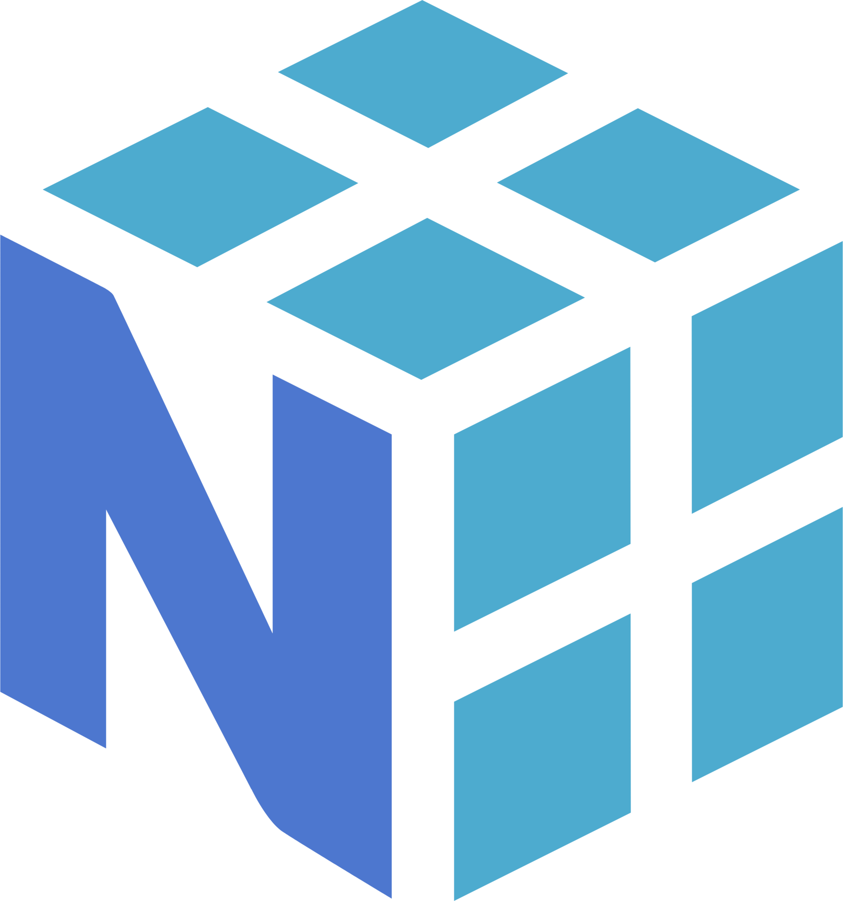

<!-- Profile Header -->

  

<h1 align="center">Hi  I'm Mohammed</h1>

  
  
  

  
  
  
  
  

---

<!-- Typing SVG -->

  

---

<!-- About Me -->

  

### 👨‍💻 About Me

- 🤖 Passionate Machine Learning Engineer

- 🔍 Obsessed with Data and finding hidden patterns

- 🌱 Currently building **great** things

- 🤝 Open to collaborating on open-source data science projects

- 💬 Ask me about **Machine Learning** and **Data Science**

- 📫 Reach me at: [iMohd8@hotmail.com](mailto:iMohd8@hotmail.com)

- 👔 [LinkedIn](https://LinkedIn.com/in/mohammed-mahameed)

 

> "Life is full of choices…choose wisely!" ✨

---

 
<!-- Tech Stack -->
<h2 align="center">🛠️ Tech Stack</h2>
 

  
  
  
  
  
  
  
  
  
  
  
  
  
  

---

 
<!-- GitHub Stats -->
<h2 align="center">📊 GitHub Stats</h2>

  
  

---

 
<!-- Featured Projects -->
<h2 align="center">🚀 Featured Projects</h2>

  
  

 

---

<!-- Fun GIF -->

  

<!-- Footer -->

  
  
  
  

<!-- End -->

